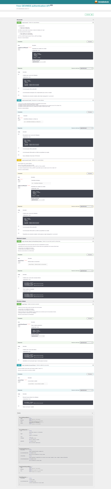

V4 (et FINALEEEEE) pour TP 4 du 18/06/2024 : La réservation de scéances de cinéma


# WEB SERVICE : Movie Project

## Table des matières

1. [Avant de commencer](#avant-de-commencer)
2. [Contexte](#contexte)
3. [Introduction](#introduction)
4. [Membres du projet](#membres-du-projet)
5. [Technologies utilisées](#technologies-utilisées)  
6. [Contraintes](#contraintes)
7. [Documentations](#documentations)
8. [Contact](#contact)  


## Avant de commencer
Ceci est un projet d'un Web Service REST, en JAVA avec Spring.


### Prérequis

Pour plus de simplicité, vous pouvez utiliser Docker, ou si vous êtes à l'aise en Java, un environnement de dev


#### Avec Docker
- Installer Docker : https://docs.docker.com/engine/install/


#### Avec tout le nécessaire en local
- Java évidement :
	- Téléchargez et installez Java JDK à partir du site officiel d'Oracle : https://www.oracle.com/java/technologies/javase/jdk21-archive-downloads.html
	- Suivez les instructions d'installation pour votre système d'exploitation
- Maven :
	- Téléchargez et installez Apache Maven à partir du site officiel : https://maven.apache.org/download.cgi
    - Décompressez l'archive téléchargée dans un répertoire de votre choix. 
    - Configurez la variable d'environnement  M2_HOME pour qu'elle pointe vers le répertoire Maven que vous venez de décompresser. 
    - Ajoutez le répertoire  bin de Maven à votre variable d'environnement  PATH. 
- PostgreSQL
	- Téléchargez et installez : https://www.postgresql.org/download/
	- Suivez les instructions d'installation pour votre système d'exploitation
- PGAdmin 
	- Téléchargez et installez : https://www.pgadmin.org/download/
	- Suivez les instructions d'installation pour votre système d'exploitation
	- Créer une base de donnée `movie-project`


### Installation 

1. Avant tout, cloner le projet ;) 
```sh
git clone https://github.com/BastienBrunet/movie-project.git
```

2. Avec Docker 
	- Ouvrir un CMD
	- Utilisez la commande  `cd` pour naviguer jusqu'à la racine du projet, où ce trouve le fichier `docker-compose.yaml`
	- Lancer la commande :
	```sh
	docker compose up -d
	```

3. Ou en Local
	- Ouvrer le projet avec un IDE (Eclipse, Intellij ou celui que vous connaissez bien pour du JAVA)
		
		- Un exemple avec Eclipse ( https://www.eclipse.org/downloads/ )
			- Ouvrez votre projet dans Eclipse 
			- Lancez Eclipse et ouvrez le projet en utilisant  File -> Open Projects from File System ou  File -> Import -> Maven -> Existing Maven Projects, selon votre configuration. 
			- Ouvrez le module `movie`, le module `auth`, et le module `booking`, src/main/resources
				- Modifier les 3 fichiers `application-local.properties` avec votre username et mot de passe PostgreSQL
			- Lancez les 3 services (`movie`, `auth` et `booking`) : 
				- Aller dans chacun des modules, src/main/java/com/mouvie/MODULE
				- Cliquez avec le bouton droit de la classe Application (`ClientApplication`,`AuthApplication` et `BookingApplication`), sélectionnez  Run As -> Run Configurations 
				- Choisissez le Profile `local`
				- Vos 3 services doivent tourner en même temps (http://localhost:8080/api pour le client, http://localhost:8081/api pour l'authentification et http://localhost:8082/api pour la réservation)
	
 
Maven téléchargera les dépendances nécessaires, compilera le code source et exécutera les applications Spring Boot. 

4. Tester !
Peut importe la méthode, vous pourrez accéder à l'application via un navigateur Web ou un outil comme Postman en utilisant l'URL par défaut http://localhost:8080/api


## Contexte

L’objectif est la création d’un WebService permettant la gestion d’une liste de film le plus complet en terme de fonctionnalités


## Introduction
La notion de collection de d’entité (comme des catégories, des langues …) est un des premiers concept croisé en entreprise.

- Il doit disposer de routes de récupération des films (en listing, et récupération d’entité)
- Il doit être possible de modifier un film
- Il doit être possible de créer un film
- Il doit être possible de supprimer un film


## Membres du projet 

- Bastien Brunet M2 Développement Logiciel, Mobile et IOT
- Clara Vesval M2 Développement Logiciel, Mobile et IOT

On a fait le premier projet séparemment, puis on a décidé d'utiliser la base de code de Bastien Brunet pour continuer les autres TP, et de continuer que tout les cdeux pour le Devoir Final.

(TP 1 de Clara Vesval : https://github.com/Clara-1606/WebService-Movie1)


## Technologies utilisées
- Java 21
- Spring boot 3.2.5
- PostgreSQL 


## Contraintes 
- (Faire plaisir à Richardson)
- Factoriser les fonctionnalités et industrialiser le WebService
- Disposer des notions nécessaires pour créer des WebServices avec des fonctionnalités plus complexe

### Les films :
L’entité film dispose des éléments suivants :

- Le nom (texte libre, maximum 128 charactères)
- La description (texte libre, maximum 2048 charactères)
- La date de parution (date format ISO 8601)
- La note (entier entre 0 et 5, optionel)
- Un film doit être attaché à une ou plusieurs catégories
- Un film a une affiche


### Les utilisateurs 
Les utilisateurs ont : 
- Un login
- Un mot de passe (hashé)
- Un statut, qui peut être : 
	- "open" pour un compte ouvert
	- "closed" pour un compte fermé
- Un rôle, qui peut être : 
	- "ROLE_USER" pour un simple utilisateur
	- "ROLE_ADMIN" pour un administrateur
		- Un "ROLE_ADMIN" dispose aussi de "ROLE_USER" par héritage.
- Une date de création
- Une date de modification

### Les cinémas
Les cinémas auront : 
- Des salles avec un certain nombre de place
- Pouvoir dire si un film est actuellement ou sera au cinéma


### Les codes de retour sont implémentés :

- 200 – OK, tout s’est bien passé pour une récupération de ressource ou listing ou modification avec succès
- 201 – Ressource crée avec succès
- 202 – Requête acceptée, mais aucune garantie que tout ira bien au final
- 204 – Requête traitée, mais aucune information à renvoyer
- 206 – Seul une partie du résultat de la requête est retournée
- 301 – Redirection permanente
- 302 – Redirection temporaire
- 400 – Requête invalide, malformée …
- 401 – Authentification nécessaire
- 403 – Accès à la ressource interdit
- 404 – Ressource non trouvée (absente)
- 406 – Impossible de répondre aux exigence de Accept
- 410 – La ressource n’existe plus
- 418 – Je suis une théière (indispensable à mettre en easter egg)
- 422 – Validation impossible (Impossible de traiter l’entité fournie (incompréhensible ou incomplète))


### Deux formats de sortie sont gérés :

- JSON
	-  Il devra pouvoir retourner du JSON HAL
- XML

Ces formats sont explicités via le header Accept


### Pagination

Amélioration du WebService permettant la gestion d’une liste de film. (seul une fraction de ces résultats intéresse l’utilisateur final (ou développeur)
Le résultat doit être paginé (page 1 sur 22, 10 éléments par page par exemple)


### Recherche

Il doit permettre de rechercher par titre ou par description à l'aide du paramètre query


### End Points

On doit pouvoir lister les catégories d’un film et inversement


### Uploader une affiche de film (photo)

Il devra : 
- Etre validé : (type mime, poids …),
- Le rendre disponible avec un lien 
- Et surtout pouvoir l’afficher


### WebService d’authentification
- Créer un compte utilisateur (soit par un admin, soit par un utilisateur non identifié)
- Afficher / Editer un compte utilisateur
- Créer un jeton (Token), utilisable par d’autres services 
- Permet de renouveler régulièrement ce jeton sans avoir à refaire toute la procédure
- Appliquer les notions élémentaires de sécurité pour être protégée du brut force


### Système de droits
Seul un admin peut créer / mettre à jour / supprimer un film ou une catégorie !


### WebService de réservation
Les utilisateurs devront pouvoir accéder à une liste de films, certains de ces films auront des disponibilités au cinéma, avec la possibilité de réserver sa place dans une salle :

- Réaliser un WebService de réservation avec des contraintes de charge
	- L'utilisateur devra prendre un ticket en s'inscrivant dans une liste d'attente il aura les informations suivantes : 
		- Sa place dans la file
		- Un status indiquant si il peut valider son inscription ou si sa demande est expirée
		- Une date d'expiration de la demande si c'est à son tour
		- Une fois que c'est au tour de l'utilisateur de valider son inscription, il pourra la valider si sa place n'est pas expiré.
- Faire parler des services ensemble (SOA)
- Rendre possible une scalabilité horizontale


### Notifications par mail
- Notifier les utilisateurs inscrit d’une sortie prochaine par mail
- Notifier par mail le bon déroulé des opérations


## Documentations

Implémentation de la documentation OpenAPI (anciennement Swagger) disponible lorsqu'on lance le projet :
- http://localhost:8080/swagger-ui/index.html
- http://localhost:8080/v3/api-docs

Implémentation de la documentation Postman disponible n'importe quand :
- https://documenter.getpostman.com/view/25108943/2sA3Bq5rR2

- Contrat d'interface : 
	- Pour l'authentification :
		
	- Pour la réservation : 
		- PDF -> /contrat_interface/contrat_total.pdf


## Contact 

Clara Vesval (https://clara-1606.github.io/) [![LinkedIn][linkedin-shield]][linkedin-url-clara].  
Bastien Brunet   [![LinkedIn][linkedin-shield]][linkedin-url-bastien].

[linkedin-shield]: https://img.shields.io/badge/-LinkedIn-black.svg?style=for-the-badge&logo=linkedin&colorB=555
[linkedin-url-clara]: https://www.linkedin.com/in/clara-vesval-84b911193/
[linkedin-url-bastien]: https://www.linkedin.com/in/bastienbrunet/
